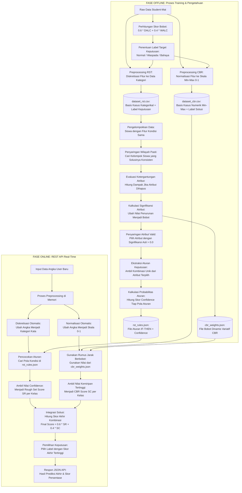

# Alur Proyek End-to-End: Integrasi RST + CBR untuk Prediksi Tingkat Kecanduan Alkohol

Dokumen ini menjelaskan aliran data dan proses komputasi sistem secara menyeluruh, dibagi menjadi 2 fase utama: offline (pembentukan pengetahuan) dan online (prediksi real-time).

## Data Flow End-to-End

